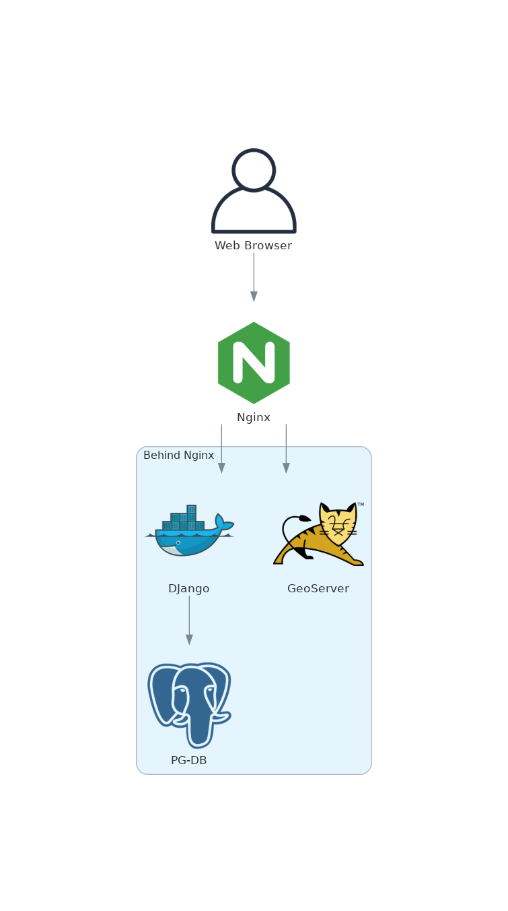

# Documentation on this project.

Services in use:

* PostgreSQL/PostGIS
* GeoServer
* Nginx

## Main Commands:

* `make build`: Build the dev environment
* `make dev-up`: Bring the dev system up
* `make build-prod`: Build the prod environment
* `make prod-up`: Bring the dev system up
* `make production`: Bring prod up from scratch
* `make down`: Bring the system down
* `make clean`: Bring down the system and kill it
* `make backup`: Backup the database
* `make restore`: Restore a copy of the database
* `make health`: Run a health check - exit with error on failure

## Service Diagram

