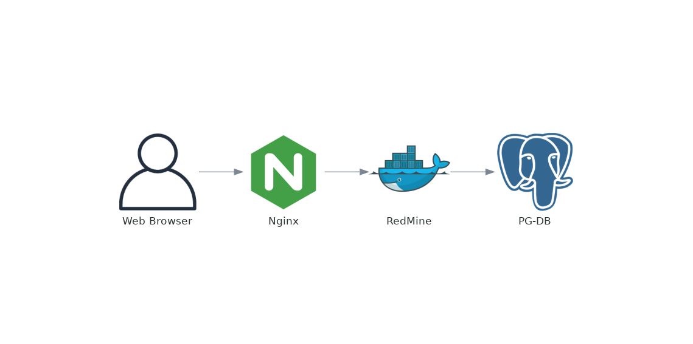

# Documentation on this project.

Services in use:

* PostgreSQL/PostGIS
* GeoServer
* Nginx

## Main Commands:

* `make` or `make help` - Will show the main commands, and simple help messages
* `make build` - Will fetch the services as required
* `make up` - Will bring the services up
* `make down` - Will bring the services down
* `make clean` - Will bring the services down, and remove all downloaded images, and delete local data

## Service Diagram

